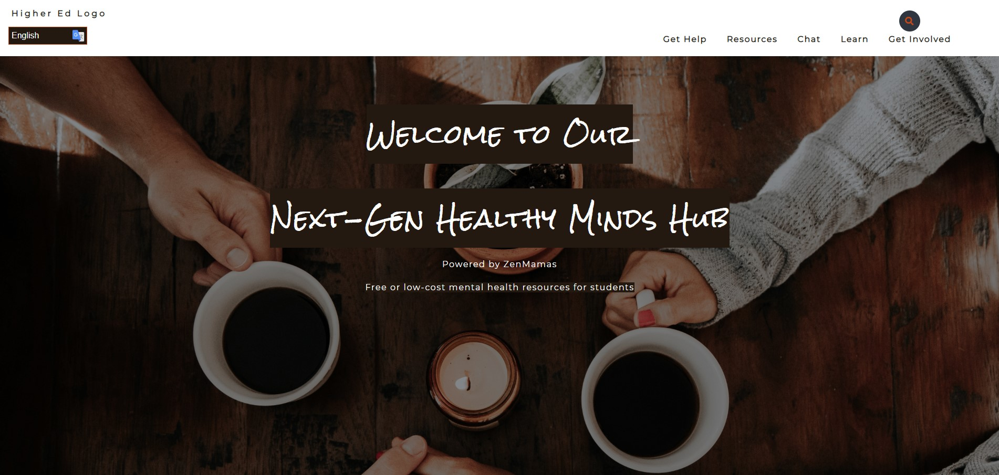

# Next-Gen Healthy Minds Hub

View on Netlify: [Next-Gen Healthy Minds Hub](https://zenmamas.netlify.com)

## About the Project

Our product is an open-source resource that colleges and universities could easily customize to link students with free or low-cost mental health resources, including a chat feature for peer-to-peer counseling programs to utilize and the potential to raise funding to sponsor accessible student mental health services.  This product is created from the ZenMamas, a team that is part of Cohort 4 of [The Moms Can: Code School](https://www.momscan.co/).

## Project Guidelines

Our challenge was to create a resource for college students to receive assistance with covering basic needs, i.e. connection to on campus support, low-cost housing, federal support programs, instruction on applying for food stamps, locations of food banks, locations of places for showers, ways to access personal hygiene items, other housing options, budgeting help, etc. 

_From scratch to product, our steps for development_
1.  Define purpose/vision for the site
2.  Develop goals for the site
3.  Define audiences and goals
4.  Conduct task analysis and prioritize tasks
5.  Determine measurable usability objectives
6.  Discuss expectations, requirements and preferences
7.  Determine accessibility requirements and needs
8.  Identify available resources and training needs
9.  Discuss initial technology needs
10.  Timeline and Project Plan 

## Project Partial Screenshot

## Project Wireframe

The website wireframe in Figma, which can be viewed [here](https://www.figma.com/file/3VvFXzXq1I4i858HC8mHNb/MOMSCANCO-FINAL-WIREFRAME?node-id=0%3A1).

## Contact

Sarah Buckingham
* [Portfolio](https://sbuckingham89.github.io/)
* Github: [sbuck](https://github.com/sbuckingham89)
* Twitter: [@sbuck89](https://twitter.com/sbuck89)

Jacqueline deGuzman
* Github: [jacksdeguzman](https://github.com/jacksdeguzman)
* Twitter: [@jacksdeguzman](https://twitter.com/jacksdeguzman)

Claire Helland
* [Portfolio](https://clairehelland.github.io/portfolio/)
* Github: [clairehelland](https://github.com/clairehelland)
* Twitter: [@clairetjames](https://twitter.com/clairetjames)

Almarose Revives
* Github: [arevives](https://github.com/arevives)
* Twitter: [@AlmaroseR](https://twitter.com/AlmaroseR)

Racquel Tung
* [Portfolio](https://racqueltung.dev/)
* Github: [racqcancode](https://github.com/racqcancode)
* Twitter: [@racqcancode](https://twitter.com/racqcancode)